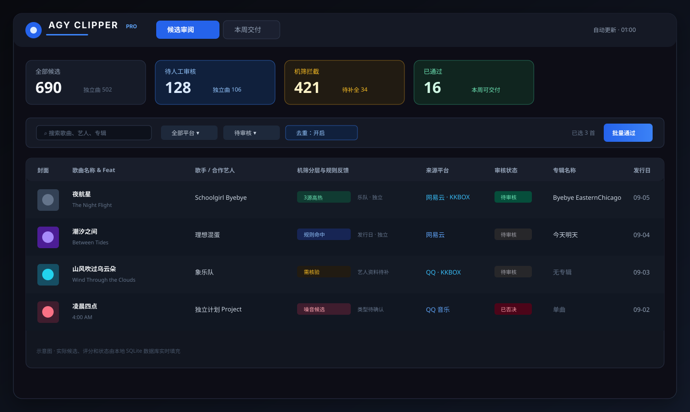
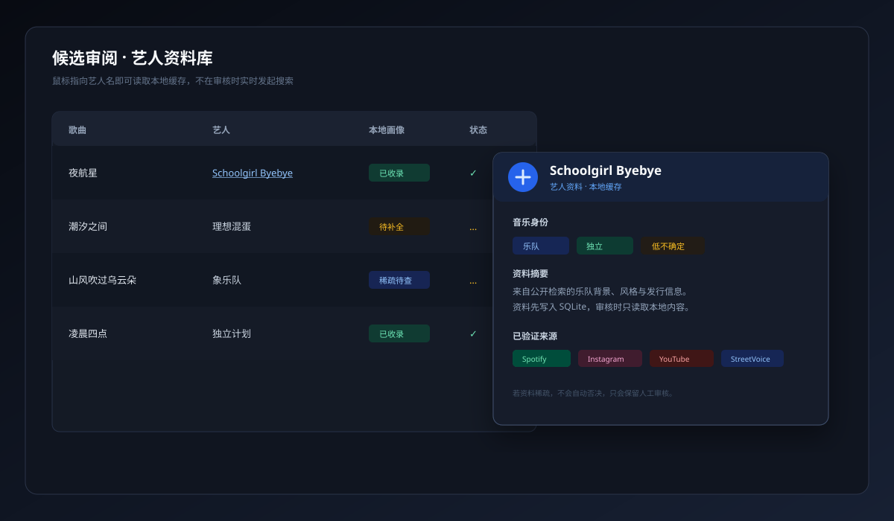
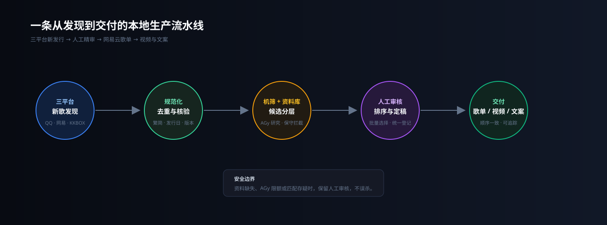
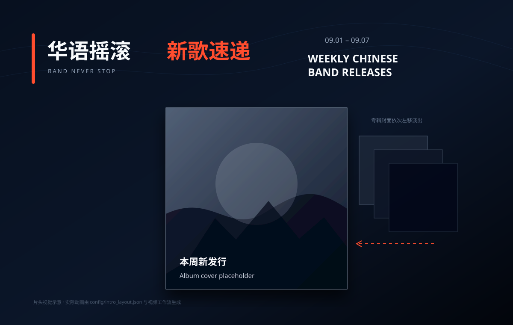

# NetEase Weekly Clipper

一个面向华语摇滚/独立音乐周报的本地化生产工作台：自动发现 QQ 音乐、网易云音乐与 KKBOX 的新发行，宽松机筛后交给我人工审核、排序和定稿，再按顺序创建网易云歌单，并衔接研究、克隆音色 TTS、片头动画、歌曲串接、整片渲染和发布文案。

> 这是一个为真实周更流程做的个人工具，不是只展示抓取结果的爬虫。数据、登录态、音频、模型和最终视频默认留在本机。

## 我为什么做这个工具

我原本每天都要打开多个音乐平台，手动翻新专辑和新歌列表，复制歌名、艺人、发行类型，再一点点整理成歌单。这个过程既重复，又容易漏掉小众乐队，还会因为繁简、括号后缀或同一首歌在多个平台出现而反复返工。

所以我把它整理成一个本地工作台：让脚本负责持续收集和归一化，让机筛负责“宁可多留误报”，把真正需要判断的部分留给我；我只需要在表格里批量选中、排序、审核，确认后就能继续后面的周报制作。

## 先看演示

下面的图是随仓库提供的可缩放 SVG 示意图，展示界面层级和数据流；实际候选、艺人资料、歌单与视频文件仍读取本地数据，不会被写进图片。

### 候选审阅工作台



### 艺人资料库悬停卡片



### 从发现到交付



### 周报片头视觉



## 现在能做什么

### 1. 三平台新歌发现

- **QQ 音乐**：读取最新专辑/新歌列表，并按华语、粤语等配置的地区或分类采集。
- **网易云音乐**：读取新专辑列表，默认支持最多 15 页，适合每天运行以覆盖滚动刷新内容。
- **KKBOX 台区**：通过 KKBOX Open API 和指定分类入口采集；没有 API 数据时仍保留 Chrome Sidecar/本地桥接入口作为补充。
- 每天北京时间 **01:00** 定时运行，服务启动时也可立即同步；重复记录按平台 ID、歌名和艺人归一化去重。

### 2. 按周报规则选曲

- 完整专辑只取**第二首歌**，避免把 intro 当作本期主推曲目。
- EP 和单曲按发行条目收录，不强制套用专辑规则。
- 支持发行日期窗口，只保留本周发布内容；标题会处理繁简差异、括号、版本和 Remix 等常见后缀，降低网易云匹配失败率。
- 机筛保持偏宽松：偏好乐队、摇滚、独立音乐，但不会因为信息不足就直接丢弃候选，剩余低分候选仍可在工作台展开查看。

### 3. 表格化人工审核

- 8502 工作台提供类似 Excel 的候选表格：多行选择、批量通过/拒绝/暂缓、批量登记、快捷复制和排序。
- 歌曲不重复展示；人工选中的行就是后续操作对象，不需要再逐条打勾。
- 定稿后可预览最终顺序，支持删除、重新排序和再次核对发行日期。
- 人工反馈会写入 SQLite；样本达到安全门槛后才启用个性化偏好模型，并保留回滚能力。

### 4. 本地艺人资料库

- 新艺人随新歌同步进入资料队列，由 AGy 优先检索艺人名；结果不足时自动追加“歌名 + 艺人”和“专辑名 + 艺人”查询。
- 资料、来源、摘要、可信度和最后更新时间落在本地数据库，审核时悬停艺人名即可显示，不在表格操作期间实时发起搜索。
- 资料库还能反过来参与二次机筛，识别乐队、摇滚/独立音乐背景并给出可解释的提示；不确定的记录保留为待人工确认。

### 5. 网易云交付和视频工作流

1. 人工确认歌曲与顺序。
2. 按确认顺序匹配网易云歌曲并创建/更新周更歌单（发布前支持 dry-run）。
3. 读取本地艺人/发行资料，生成本期研究内容和发布文案。
4. 使用配置的克隆音色生成 TTS，制作片头专辑动画、歌曲播放段和整片。
5. 输出视频、日志、歌单链接与文案，供后续发布流程使用。

## 快速开始

### 环境

- macOS/Linux
- Python 3.11+
- Node.js 18+
- 已登录的网易云 Cookie（本地 `cookie.txt`）
- 可选：KKBOX Open API 凭据、AGy CLI 登录态、克隆音色/TTS 模型

```bash
git clone https://github.com/wangziqi0214-cpu/NetEase-Weekly-Clipper.git
cd NetEase-Weekly-Clipper

python3.11 -m venv .venv311
.venv311/bin/python -m pip install -r requirements.txt
cp .env.example .env

# 填写 .env 后构建审核工作台
npm --prefix review_workbench ci
npm --prefix review_workbench run build
```

启动常驻服务（每天 01:00、启动时同步）：

```bash
.venv311/bin/python -m song_discovery.cli daemon \
  --interval-days 1 \
  --daily-hour 1 \
  --bridge-port 8765 \
  --review-port 8502 \
  --db-path output/discovery.db \
  --cookie-file cookie.txt
```

浏览器打开 `http://127.0.0.1:8502/` 进入审核工作台。想让它随 macOS 登录自动启动，可以在构建前端后运行：

```bash
make daemon-install
```

### 常用命令

```bash
# 单独采集
.venv311/bin/python -m song_discovery.cli collect --platform all

# 查看平台与候选状态
.venv311/bin/python -m song_discovery.cli status
.venv311/bin/python -m song_discovery.cli stats

# 检查网易云登录态
.venv311/bin/python -m song_discovery.cli login-status --cookie-file cookie.txt

# 预览发布，不修改网易云
.venv311/bin/python -m song_discovery.cli publish --dry-run

# 同步/补齐艺人资料
.venv311/bin/python -m song_discovery.cli sync-artist-knowledge --all
```

旧版离线视频流程仍保留在 `run.py`：

```bash
python run.py crawl "歌单链接"
python run.py research
python run.py edit
python run.py render
# 或：python run.py full "歌单链接"
```

## 配置与安全

`.env.example` 只包含空的配置名。请把真实值放在本机 `.env`，不要提交以下内容：

- `.env`、网易云 `cookie.txt`、KKBOX Client Secret、AI API Key；
- `output/` 下的 SQLite 数据库、任务状态、日志、封面、音频和视频；
- 本地 TTS/MLX 模型、克隆音色参考文件和任何导出的个人资料。

这些路径已在 `.gitignore` 中排除；公开仓库只包含源码、配置模板、文档和无敏感信息的演示图。AGy 的登录态和模型配置也应留在运行机器，不要写进 README 或代码。

## 项目结构

```text
song_discovery/       三平台采集、去重、机筛、艺人资料、发布与常驻调度
review_workbench/     React + Glide Data Grid 审核工作台
src/                  研究、音频、TTS、片头与视频渲染模块
chrome_extension/     KKBOX 页面采集 Sidecar（备用入口）
scripts/launchd/      macOS LaunchAgent 安装脚本
tests/                Python、前端与扩展测试
docs/                 架构、运行手册、KKBOX 与艺人资料说明
output/               本机运行产物（不会提交）
```

## 文档

- [详细说明](docs.md)
- [一体化系统架构](docs/architecture.md)
- [无人值守运行指南](docs/unattended_operation_guide.md)
- [KKBOX 扩展与桥接指南](docs/kkbox_extension_guide.md)
- [艺人资料库与交付计划](docs/artist-library-and-delivery-plan.md)
- [发现模块验证记录](docs/discovery_validation.md)

## 测试

```bash
make test
```

这会依次运行 Python 测试、构建 React 工作台，以及 KKBOX Chrome 扩展的 Node 测试。只想快速检查后端时，也可以运行：

```bash
.venv311/bin/pytest -q
```

## 许可证

仓库目前公开用于代码查看和个人使用，但尚未声明开源许可证；在补充 `LICENSE` 之前，请不要把它理解为授予再分发或商业使用权。
